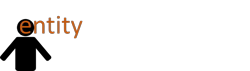

```{r, echo=FALSE}
desc <- suppressWarnings(readLines("DESCRIPTION"))
regex <- "(^Version:\\s+)(\\d+\\.\\d+\\.\\d+)"
loc <- grep(regex, desc)
ver <- gsub(regex, "\\2", desc[loc])
verbadge <- sprintf('<a href="https://img.shields.io/badge/Version-%s-orange.svg"></a></p>', ver, ver)
````

[](http://www.repostatus.org/#active)
[](https://travis-ci.org/trinker/entity)
[](https://coveralls.io/r/trinker/entity?branch=master)
`r verbadge`

```{r, echo=FALSE, message=FALSE}
library(knitr)
knit_hooks$set(htmlcap = function(before, options, envir) {
  if(!before) {
    paste('<p class="caption"><b><em>',options$htmlcap,"</em></b></p>",sep="")
    }
    })
knitr::opts_knit$set(self.contained = TRUE, cache = FALSE)
knitr::opts_chunk$set(fig.path = "tools/figure/")
```

 


**entity** is wrapper to simplify and extend [**NLP**](https://cran.r-project.org/web/packages/NLP/index.html) and [**openNLP**](https://cran.r-project.org/web/packages/openNLP/index.html) named entity recognition.  The package contains 6 entity extractors that take a text vector and return a list of vectors of named entities.  The entity extractors include:

1. `person_entity`
2. `location_entity`
3. `organization_entity`
4. `date_entity`
5. `money_entity`
6. `percent_entity`
        
# Installation

To download the development version of **entity**:

Download the [zip ball](https://github.com/trinker/entity/zipball/master) or [tar ball](https://github.com/trinker/entity/tarball/master), decompress and run `R CMD INSTALL` on it, or use the **pacman** package to install the development version:

```r
if (!require("pacman")) install.packages("pacman")
pacman::p_load_gh("trinker/entity")
```

# Contact

You are welcome to:
* submit suggestions and bug-reports at: <https://github.com/trinker/entity/issues>
* send a pull request on: <https://github.com/trinker/entity/>
* compose a friendly e-mail to: <tyler.rinker@gmail.com>

# Examples

The following examples demonstrate some of the functionality of **termco**.

## Load the Package/Data

```{r, message=FALSE}
library(entity)
```

I will demonstrate the 6 annotators on this [Wikipedia excerpt](https://en.wikipedia.org/wiki/Bell_Labs) about Bell Labs (plus one non Wikipedia line at the end).

```{r}
data(wiki)
wiki
```

## Entity Extractors

### Person Entities

```{r}
person_entity(wiki)
```

### Location Entities

```{r}
location_entity(wiki)
```

### Organization Entities

```{r}
organization_entity(wiki)
```

### Entities

```{r}
date_entity(wiki)
```

### Money Entities

```{r}
money_entity(wiki)
```

### Percent Entities

```{r}
percent_entity(wiki)
```


## Plotting

```{r, fig.height = 7}
organizations <- organization_entity(presidential_debates_2012$dialogue)
plot(organizations)
```

You can include only entities above a minimum frequency (`min = n`) as shown below:

```{r, fig.height}
plot(organizations, min = 2)
```

The user may wish to view the entities alphabetically rather than by frequency.  Use `alphabetical = TRUE` to accomplish this:

```{r, fig.height = 7}
plot(organizations, alphabetical = TRUE)
```


