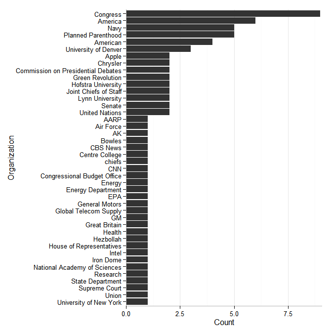
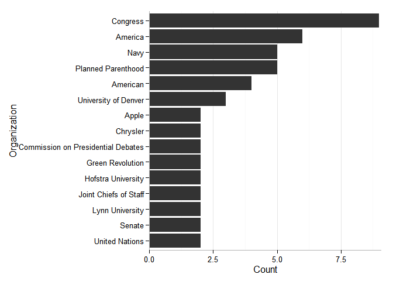
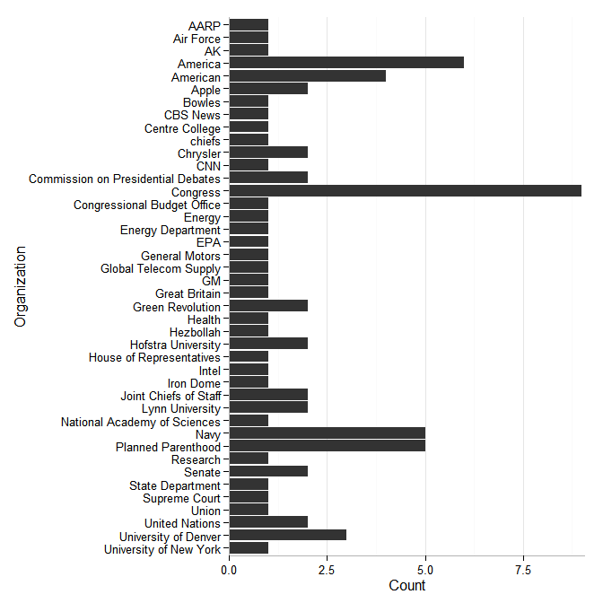

entity
============

**entity** is wrapper to simplify and extend
[**NLP**](https://cran.r-project.org/web/packages/NLP/index.html) and
[**openNLP**](https://cran.r-project.org/web/packages/openNLP/index.html)
named entity recognition. The package contains 6 entity extractors that
take a text vector and return a list of vectors of named entities. The
entity extractors include:

1.  `person_entity`
2.  `location_entity`
3.  `organization_entity`
4.  `date_entity`
5.  `money_entity`
6.  `percent_entity`

Table of Contents
============

-   [Installation](#installation)
-   [Contact](#contact)
-   [Examples](#examples)
    -   [Load the Package/Data](#load-the-packagedata)
    -   [Entity Extractors](#entity-extractors)
        -   [Person Entities](#person-entities)
        -   [Location Entities](#location-entities)
        -   [Organization Entities](#organization-entities)
        -   [Entities](#entities)
        -   [Money Entities](#money-entities)
        -   [Percent Entities](#percent-entities)
    -   [Plotting](#plotting)

Installation
============

To download the development version of **entity**:

Download the [zip
ball](https://github.com/trinker/entity/zipball/master) or [tar
ball](https://github.com/trinker/entity/tarball/master), decompress and
run `R CMD INSTALL` on it, or use the **pacman** package to install the
development version:

    if (!require("pacman")) install.packages("pacman")
    pacman::p_load_gh("trinker/entity")

Contact
=======

You are welcome to: 
* submit suggestions and bug-reports at: <https://github.com/trinker/entity/issues> 
* send a pull request on: <https://github.com/trinker/entity/> 
* compose a friendly e-mail to: <tyler.rinker@gmail.com>

Examples
========

The following examples demonstrate some of the functionality of
**termco**.

Load the Package/Data
---------------------

    library(entity)

I will demonstrate the 6 annotators on this [Wikipedia
excerpt](https://en.wikipedia.org/wiki/Bell_Labs) about Bell Labs (plus
one non Wikipedia line at the end).

    data(wiki)
    wiki

    ## [1] "Bell Laboratories (also known as Bell Labs and formerly known as AT&T Bell Laboratories and Bell Telephone Laboratories) is a research and scientific development company that belongs to Alcatel-Lucent."                                                                             
    ## [2] "Its headquarters are located in Murray Hill, New Jersey, in addition to other laboratories around the rest of the United States and in other countries."                                                                                                                               
    ## [3] "The historic laboratory originated in the late 19th century as the Volta Laboratory and Bureau created by Alexander Graham Bell."                                                                                                                                                      
    ## [4] "Bell Labs was also at one time a division of the American Telephone & Telegraph Company (AT&T Corporation), half-owned through its Western Electric manufacturing subsidiary."                                                                                                         
    ## [5] "Researchers working at Bell Labs are credited with the development of radio astronomy, the transistor, the laser, the charge-coupled device (CCD), information theory, the UNIX operating system, the C programming language, S programming language and the C++ programming language."
    ## [6] "Eight Nobel Prizes have been awarded for work completed at Bell Laboratories."                                                                                                                                                                                                         
    ## [7] "And an extra line not from Wikipedia worth 2 cents or .001% of 1 percent."

Entity Extractors
-----------------

### Person Entities

    person_entity(wiki)

    ## [[1]]
    ## NULL
    ## 
    ## [[2]]
    ## NULL
    ## 
    ## [[3]]
    ## [1] "Alexander Graham Bell"
    ## 
    ## [[4]]
    ## NULL
    ## 
    ## [[5]]
    ## NULL
    ## 
    ## [[6]]
    ## NULL
    ## 
    ## [[7]]
    ## NULL

### Location Entities

    location_entity(wiki)

    ## [[1]]
    ## NULL
    ## 
    ## [[2]]
    ## [1] "Murray Hill"   "New Jersey"    "United States"
    ## 
    ## [[3]]
    ## NULL
    ## 
    ## [[4]]
    ## [1] "Telegraph"
    ## 
    ## [[5]]
    ## NULL
    ## 
    ## [[6]]
    ## NULL
    ## 
    ## [[7]]
    ## NULL

### Organization Entities

    organization_entity(wiki)

    ## [[1]]
    ## [1] "Bell Laboratories"           "Bell Labs"                  
    ## [3] "Bell Laboratories"           "Bell Telephone Laboratories"
    ## 
    ## [[2]]
    ## NULL
    ## 
    ## [[3]]
    ## [1] "Volta Laboratory"      "Alexander Graham Bell"
    ## 
    ## [[4]]
    ## [1] "Bell Labs"                             
    ## [2] "American Telephone & Telegraph Company"
    ## [3] "AT&T Corporation"                      
    ## [4] "Western Electric"                      
    ## 
    ## [[5]]
    ## [1] "Bell Labs"
    ## 
    ## [[6]]
    ## [1] "Bell Laboratories"
    ## 
    ## [[7]]
    ## NULL

### Entities

    date_entity(wiki)

    ## [[1]]
    ## NULL
    ## 
    ## [[2]]
    ## NULL
    ## 
    ## [[3]]
    ## [1] "late 19th century"
    ## 
    ## [[4]]
    ## NULL
    ## 
    ## [[5]]
    ## NULL
    ## 
    ## [[6]]
    ## NULL
    ## 
    ## [[7]]
    ## NULL

### Money Entities

    money_entity(wiki)

    ## [[1]]
    ## NULL
    ## 
    ## [[2]]
    ## NULL
    ## 
    ## [[3]]
    ## NULL
    ## 
    ## [[4]]
    ## NULL
    ## 
    ## [[5]]
    ## NULL
    ## 
    ## [[6]]
    ## NULL
    ## 
    ## [[7]]
    ## [1] "2 cents"

### Percent Entities

    percent_entity(wiki)

    ## [[1]]
    ## NULL
    ## 
    ## [[2]]
    ## NULL
    ## 
    ## [[3]]
    ## NULL
    ## 
    ## [[4]]
    ## NULL
    ## 
    ## [[5]]
    ## NULL
    ## 
    ## [[6]]
    ## NULL
    ## 
    ## [[7]]
    ## [1] ".001%"     "1 percent"

Plotting
--------

    organizations <- organization_entity(presidential_debates_2012$dialogue)
    plot(organizations)

You can include only entities above a minimum frequency (`min = n`) as
shown below:

    plot(organizations, min = 2)

The user may wish to view the entities alphabetically rather than by
frequency. Use `alphabetical = TRUE` to accomplish this:

    plot(organizations, alphabetical = TRUE)

